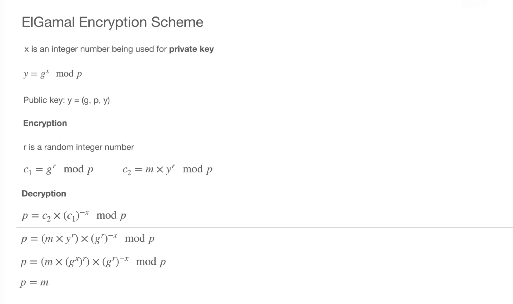
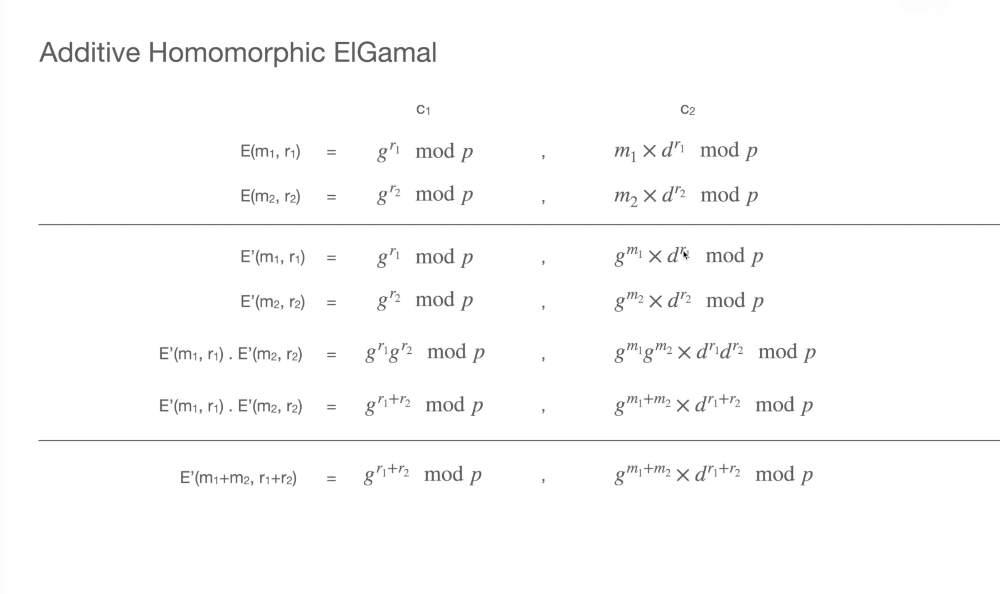
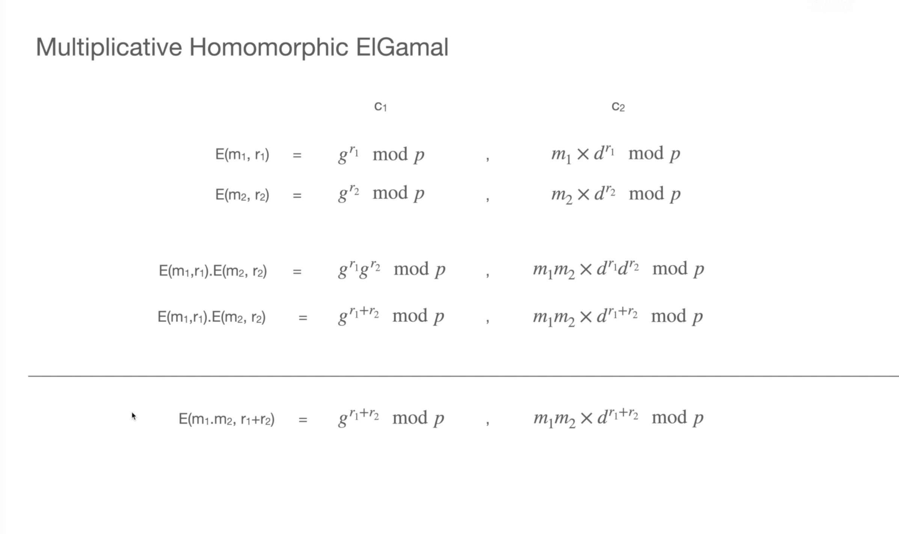

# phe-bee 🐝 | Partially Homomorphic Encryption Sandbox



## Description

This Python sandbox is an implementation of the **Partially Homomorphic Encryption** scheme using the **ElGamal Cryptosystem**. We first cover the key generation, encryption, and decryption, by following the mathematical principles behind the **ElGamal’s Partially Homomorphic** features, which allow for certain computations to be performed on encrypted data.

The **phe-bee** can perform two types of **Homomorphic** operations:

* Homomorphic Addition: Allows adding two encrypted values to get the encrypted sum or to add an encrypted value to a **constant**.



* Homomorphic Multiplication: Allows us to multiply an encrypted value by a **constant** to get the encrypted product.



## Encryption and Homomorphic Operations

This Python script demonstrates encryption using a prime number-based encryption scheme and performs homomorphic operations on the encrypted data. The script includes functions for encryption, decryption, and key generation, as well as examples of multiplicative and additive homomorphic operations.

## Dependencies

The script requires the following dependencies:

* `prime` module: This module should be imported to generate prime numbers.
* `random` module: This module is used for generating random numbers.

To use the script, ensure that the `prime` module is available in the same directory as the script or in a location accessible to Python's module search path.

## Usage (Basic)

```console
python phe-bee.sandbox.py
```

OR

```console
python3 phe-bee.sandbox.py
```

## Usage (Advanced)

```python
from prime import *
import random

# Encryption function
def encrypt(m, r, exponential=False):
    # ... implementation details ...

# Decryption function
def decrypt(c1, c2):
    # ... implementation details ...

# Key generation
p = generate_random_prime_number(bits=1024)
g = random.randint(1, p-1)
x = generate_random_prime_number(bits=512)  # private key
y = pow(g, x, p)                            # public key

# Encryption and decryption example
m = 100                                     # message to encrypt
r = random.randint(1, p-1)                  # random encryption number
c1, c2 = encrypt(m, r)
p = decrypt(c1, c2)

# Multiplicative homomorphic operations
m1 = 9
m2 = 11
r1 = random.randint(1, p-1)
r2 = random.randint(1, p-1)
m1_encrypted = encrypt(m1, r1)
m2_encrypted = encrypt(m2, r2)
h1 = encrypt(m1*m2, r1+r2)
h2 = m1_encrypted[0]*m2_encrypted[0] % p, m1_encrypted[1]*m2_encrypted[1] % p

# Additive homomorphic operations
m1_encrypted = encrypt(m1, r1, exponential=True)
m2_encrypted = encrypt(m2, r2, exponential=True)
h1 = encrypt(m1+m2, r1+r2, exponential=True)
h2 = m1_encrypted[0]*m2_encrypted[0] % p, m1_encrypted[1]*m2_encrypted[1] % p
```

## Functions

### `encrypt(m, r, exponential=False)`

This function performs encryption on a given message `m` using a random encryption number `r`. The encryption is based on a prime number-based scheme.

* `m`: The message to encrypt.
* `r`: The random encryption number.
* `exponential` (optional): A boolean flag indicating whether to use exponential encryption. Default is `False`.

Returns a tuple `(c1, c2)` representing the encrypted message.

### `decrypt(c1, c2)`

This function performs decryption on a given pair of ciphertexts `c1` and `c2` using the private key `x`.

* `c1`: The first part of the ciphertext.
* `c2`: The second part of the ciphertext.

Returns the decrypted message.

### `generate_random_prime_number(bits)`

This function generates a random prime number with the specified number of `bits`.

* `bits`: The number of bits for the prime number.

Returns the generated prime number.

## Example

The script includes an example that demonstrates the usage of the encryption and homomorphic operations.

```python
# Key generation
p = generate_random_prime_number(bits=1024)
g = random.randint(1, p-1)
x = generate_random_prime_number(bits=512)

  # private key
y = pow(g, x, p)                            # public key

# Encryption and decryption example
m = 100                                     # message to encrypt
r = random.randint(1, p-1)                  # random encryption number
c1, c2 = encrypt(m, r)
p = decrypt(c1, c2)

# Multiplicative homomorphic operations
m1 = 9
m2 = 11
r1 = random.randint(1, p-1)
r2 = random.randint(1, p-1)
m1_encrypted = encrypt(m1, r1)
m2_encrypted = encrypt(m2, r2)
h1 = encrypt(m1*m2, r1+r2)
h2 = m1_encrypted[0]*m2_encrypted[0] % p, m1_encrypted[1]*m2_encrypted[1] % p

# Additive homomorphic operations
m1_encrypted = encrypt(m1, r1, exponential=True)
m2_encrypted = encrypt(m2, r2, exponential=True)
h1 = encrypt(m1+m2, r1+r2, exponential=True)
h2 = m1_encrypted[0]*m2_encrypted[0] % p, m1_encrypted[1]*m2_encrypted[1] % p
```

In the example, a prime number `p` and a random integer `g` are generated for key generation. The private key `x` and public key `y` are derived from these values. Then, a message `m` is encrypted using a random encryption number `r`, and the ciphertext is decrypted back to the original message. The example also demonstrates multiplicative and additive homomorphic operations on encrypted messages.
